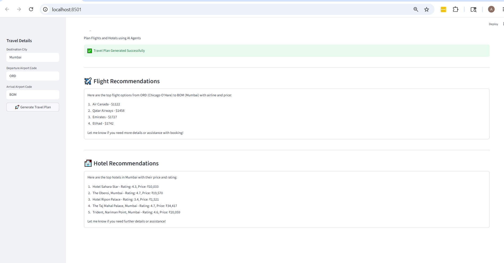

# 🌍 AI Travel Planner

An AI-powered Travel Planner built using **VS Code**, **Streamlit**, **CrewAI**, **OpenAI**, and **SerpAPI**.

The application uses multiple AI agents to search for:

- ✈️ Flight Recommendations
- 🏨 Hotel Recommendations
- 📋 Travel Planning Assistance

Users enter travel details, and AI agents collaborate to generate flight and hotel recommendations.

---

# 🚀 Features

## ✈️ Flight Search Agent

Searches flights between departure and destination airports and recommends the best options.

Example:

- Air Canada - $1121
- Qatar Airways - $1458
- Emirates - $1727
- Etihad - $1742

---

## 🏨 Hotel Search Agent

Searches hotels in the selected destination and recommends top-rated hotels with pricing.

Example:

- Taj Mahal Palace
- The Oberoi
- Trident Nariman Point
- Hotel Sahara Star
- Sea Green Hotel

---

## 🤖 AI Multi-Agent Architecture

The application uses multiple CrewAI agents:

| Agent | Responsibility |
|---------|--------------|
| Flight Expert | Searches and recommends flights |
| Hotel Expert | Searches and recommends hotels |

---

# 🏗️ Technology Stack

### Frontend

- Streamlit

### Backend

- Python 3.11+
- CrewAI

### AI Model

- OpenAI GPT

### External APIs

- SerpAPI
  - Google Flights
  - Google Hotels

---

# 📂 Project Structure

```text
TravelPlanner
│
├── app.py
├── agents.py
├── crew_setup.py
├── tools.py
├── requirements.txt
├── .env
│
└── venv
```

## 📖 Project Structure Explained

| File/Folder | Purpose |
|------------|---------|
| **app.py** | Main Streamlit application. Handles user input, executes CrewAI workflows, and displays flight and hotel recommendations. |
| **agents.py** | Defines AI agents including their role, goal, backstory, and assigned tools. |
| **crew_setup.py** | Creates CrewAI tasks and crews, and orchestrates collaboration between agents. |
| **tools.py** | Contains custom tools used by agents to fetch flight and hotel data from SerpAPI. |
| **requirements.txt** | Lists all Python dependencies required to run the application. |
| **.env** | Stores API keys and environment variables. This file should never be committed to GitHub. |
| **venv/** | Python virtual environment containing isolated dependencies for the project. |
| **venv/Scripts/** | Contains activation scripts and Python executables for the virtual environment (Windows). |
| **venv/Lib/** | Stores installed Python packages and libraries used by the application. |
| **venv/Include/** | Contains header files required by certain Python packages during installation. |
| **__pycache__/** | Auto-generated folder containing compiled Python bytecode for faster execution. |

---

# 🔄 Application Flow

```text
User
 │
 ▼
Streamlit UI (app.py)
 │
 ▼
Crew Setup (crew_setup.py)
 │
 ▼
AI Agents (agents.py)
 │
 ▼
Custom Tools (tools.py)
 │
 ▼
SerpAPI
 ├── Google Flights
 └── Google Hotels
 │
 ▼
AI Recommendations
 │
 ▼
Streamlit UI
```

---

# 🔧 Prerequisites

Install the following software:

- Python 3.11 or later
- Visual Studio Code
- Git

Recommended VS Code Extensions:

- Python
- Pylance
- Python Debugger

---

# 📥 Clone Repository

```bash
git clone https://github.com/<your-github-username>/TravelPlanner.git

cd TravelPlanner
```

---

# 🐍 Create Virtual Environment

### Windows

```bash
python -m venv venv
```

Activate:

```bash
venv\Scripts\activate
```

---

### Linux / Mac

```bash
python3 -m venv venv

source venv/bin/activate
```

---

# 📦 Install Dependencies

Install all required packages:

```bash
pip install -r requirements.txt
```

---

# 🔑 Configure Environment Variables

Create a file named:

```text
.env
```

Add the following values:

```env
OPENAI_API_KEY=your_openai_api_key

SERPAPI_API_KEY=your_serpapi_api_key
```

### Important

Never commit:

```text
.env
```

to GitHub.

---

# ▶️ Run Application

Activate virtual environment:

### Windows

```bash
venv\Scripts\activate
```

Start Streamlit:

```bash
streamlit run app.py
```

Application URL:

```text
http://localhost:8501
```

---

# 🧪 Example Usage

Input:

```text
Destination City : Mumbai

Departure Airport : ORD

Arrival Airport : BOM
```

Output:

```text
Flight Recommendations

1. Air Canada - $1121
2. Qatar Airways - $1458
3. Emirates - $1727
4. Etihad - $1742


Hotel Recommendations

1. Taj Mahal Palace
2. The Oberoi
3. Trident Nariman Point
4. Hotel Sahara Star
5. Sea Green Hotel
```

---

# ⚙️ How It Works

### Step 1

User enters travel details in the Streamlit UI.

### Step 2

Streamlit invokes CrewAI.

### Step 3

Flight Expert Agent:

- Calls Flight Search Tool
- Retrieves flight information using SerpAPI

### Step 4

Hotel Expert Agent:

- Calls Hotel Search Tool
- Retrieves hotel information using SerpAPI

### Step 5

CrewAI gathers recommendations.

### Step 6

Results are displayed in the Streamlit UI.

---

# 🤖 Agent Workflow

```text
                      ┌──────────────┐
                      │    User      │
                      └──────┬───────┘
                             │
                             ▼
                    ┌────────────────┐
                    │ Streamlit UI   │
                    │   (app.py)     │
                    └──────┬─────────┘
                           │
                           ▼
                    ┌────────────────┐
                    │ CrewAI Crew    │
                    └──────┬─────────┘
                           │
          ┌────────────────┴────────────────┐
          ▼                                 ▼

 ┌────────────────┐               ┌────────────────┐
 │ Flight Expert  │               │ Hotel Expert   │
 └──────┬─────────┘               └──────┬─────────┘
        │                                │
        ▼                                ▼

 ┌────────────────┐               ┌────────────────┐
 │ Flight Tool    │               │ Hotel Tool     │
 └──────┬─────────┘               └──────┬─────────┘
        │                                │
        ▼                                ▼

 ┌────────────────┐               ┌────────────────┐
 │ Google Flights │               │ Google Hotels  │
 │   (SerpAPI)    │               │   (SerpAPI)    │
 └────────────────┘               └────────────────┘
```

---

# 🐞 Troubleshooting

## Streamlit cannot find app.py

Error:

```text
File does not exist: app.py
```

Solution:

Verify you are in the project root folder:

```bash
dir
```

Run:

```bash
streamlit run app.py
```

---

## ModuleNotFoundError

Install dependencies:

```bash
pip install -r requirements.txt
```

---

## OPENAI_API_KEY not found

Verify `.env` contains:

```env
OPENAI_API_KEY=your_key
```

---

## SERPAPI_API_KEY not found

Verify `.env` contains:

```env
SERPAPI_API_KEY=your_key
```

---

## SerpAPI DNS Error

Example:

```text
Failed to resolve serpapi.com
```

Check DNS:

```bash
nslookup serpapi.com
```

Possible causes:

- VPN
- Firewall
- Corporate Proxy
- DNS Issues

---

# 🔒 Security

Do not commit the following files/folders:

```text
.env
venv/
__pycache__/
```

Use `.gitignore`.

Example:

```gitignore
venv/
__pycache__/
.env
*.pyc
.streamlit/
```

---

# 🌟 Future Enhancements

Planned enhancements:

- 🌦 Weather Agent
- 📍 Tourist Attraction Agent
- 🍽 Restaurant Recommendation Agent
- 🗓 Day-wise Itinerary Planner
- 💰 Budget Planner
- 📄 PDF Travel Itinerary Generator
- 🗺 Google Maps Integration
- 👤 User Authentication
- 📊 Travel Analytics Dashboard
- 🌍 Multi-City Travel Planning

---

# 📷 Screenshots

## Home Screen



---

# 👨‍💻 Author

**Amit Tawari**

GitHub:

https://github.com/amittawari

LinkedIn:

https://linkedin.com/in/amit-tawari

---

# 📜 License

This project is licensed under the MIT License.
